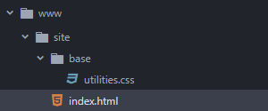
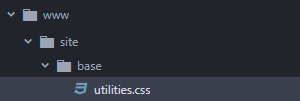
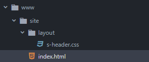
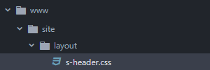
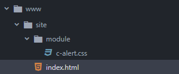
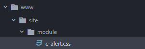
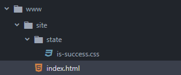
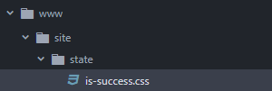
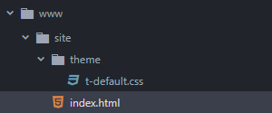
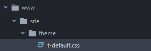

# Namespaces

## Base

**Seleciona o utilitário**
<br>

```html
<span class="u-bold">Site</span>
```

```css
.u-bold {
  /* Utilitário */
}
```

## Escopo

**Seleciona o escopo**
<br>

```html
<header id="s-header">
  <!-- Cabeçalho -->
</header>
```

```css
#s-header {
  /* Escopo */
}
```

## Componente

**Seleciona o componente**
<br>

```html
<div class="c-alert">
  <!-- Alerta -->
</div>
```

```css
.c-alert {
  /* Componente */
}
```

## Escopo

**Seleciona o estado**
<br>

```html
<div class="c-alert is-success">
  <!-- Alerta -->
</div>
```

```css
.is-success {
  /* Estado */
}
```

## Tema

**Seleciona o tema**
<br>

```html
<body id="t-default">
  <header id="s-header">
    <!-- Cabeçalho -->
  </header>
</body>
```

```css
#t-default #s-header {
  /* Tema */
}
```
